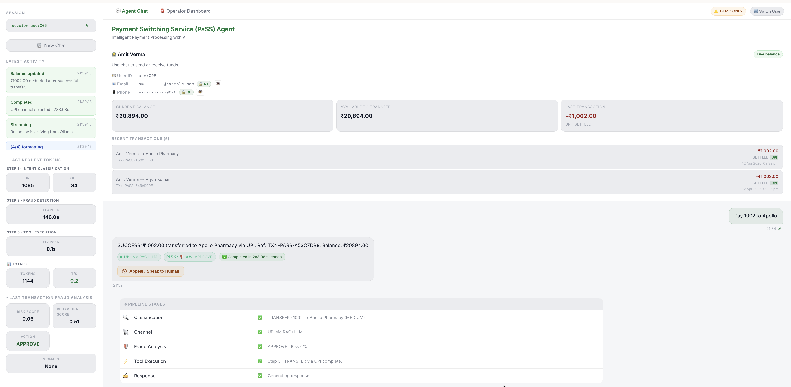

# AI-Native PaSS Orchestrator

**AI-Native Payments** is an agentic financial orchestration engine built for the **RBI Payments Switching Service (PaSS)**. It demonstrates how a production-grade multi-agent system can reason, route, and execute banking operations autonomously — with zero hardcoded business logic.

> **License:** MIT — see [LICENSE](LICENSE)



---

## ⚠️ Security Disclaimer

> **Reference implementation only. Not for production use with real funds.**
>
> Missing before any production deployment:
> - Authentication / authorization (Spring Security + JWT)
> - Rate limiting and API key management
> - HTTPS / TLS on all communication surfaces
> - Real payment processor integration (RBI-authorized)
> - Security audit, penetration testing, PCI-DSS compliance

---

## What Makes This AI-Native

Traditional payment apps wrap AI around a fixed rule engine. Here the inverse is true:

| Concern | How It Works |
|---------|-------------|
| **Payment routing** | LLM reads RAG-retrieved RBI channel rules and decides. No Java `if/else`. |
| **Intent classification** | A dedicated `IntentClassifier` extracts ACTION, BENEFICIARY, AMOUNT, CHANNEL from natural language — context includes both the **user registry** and **merchant directory** (10 merchants) so the LLM resolves "Apollo" → "Apollo Pharmacy", not the nearest user name. |
| **Channel selection** | If the user names a channel explicitly, it is used. If not, the classifier returns `UNKNOWN` and the UI presents a **channel picker** with amount-valid options — the user always has the final say. |
| **Channel validation** | `LedgerTools.validateChannelForAmount()` cross-checks the LLM's chosen channel against RBI amount rules at tool-call time. On mismatch the frontend shows a channel picker with corrected alternatives. |
| **Fraud detection** | Dedicated `FraudAgentOrchestrator` (LangChain4j agent with its own `@Tool` methods) runs as **Stage 2** of the pipeline — retrieves fraud patterns via RAG, scores behavioral telemetry with a risk-based model (baseline 0.02, higher = riskier), and determines APPROVE/MONITOR/ESCALATE/BLOCK before any balance changes. |
| **Ledger execution** | `@Tool`-annotated Java methods expose ACID-safe operations the LLM can call by name. All three tools (`transferFunds`, `receiveFunds`, `switchMandate`) commit to MongoDB via `MongoLedgerService`. |
| **Memory** | Temporal turns are vector-embedded and recalled per session. RAG knowledge is reranked per query. |
| **Human oversight** | Any decision can be appealed; operators approve / deny / override via the HITL dashboard. |
| **Token performance** | `OllamaMetricsScheduler` passively records real `TokenUsage` from every completed request. The SSE `complete` event carries `inputTokens`, `outputTokens`, `totalTokens`, and `elapsedMs`; the `Sidebar` component renders a live token/s panel. |
| **Confidence assessment** | LLM responses include `[Confidence: HIGH/MEDIUM/LOW]` tags; LOW confidence triggers clarification questions instead of tool calls. |
| **Error handling** | Contextual error messages (e.g., "AI took too long" instead of stack traces) for LLM failures; friendly SSE error events prevent verbose exceptions from reaching users. |

---

## 🔍 Enhanced Fraud Detection — LangChain4j Fraud Agent (Stage 2)

The platform features a dedicated fraud detection agent built as a separate LangChain4j `AiServices` proxy with its own `@Tool` methods, system prompt, and trust boundary. Fraud analysis runs as **Stage 2** of the multi-stage pipeline — after intent classification and before tool execution.

### Fraud Package (`com.ayedata.fraud`)

| Component | Purpose |
|-----------|---------|
| **FraudConfig** | Spring `@Configuration` — all fraud parameters externalized to `.env` / `application.properties` |
| **FraudSignalAnalyzer** | Deterministic engine — RAG retrieval, behavioral scoring, signal detection, composite risk scoring |
| **FraudTools** | 4 `@Tool` methods exposed to the Fraud Agent: `retrieveFraudPatterns`, `checkBehavioralScore`, `analyzeFraudSignals`, `computeRiskAndAction` |
| **FraudAgent** | LangChain4j `AiServices` interface with `@SystemMessage` encoding action thresholds |
| **FraudAgentOrchestrator** | Builds the agent, exposes `analyze()`, `parseAgentResponse()`, `deterministicFallback()` |
| **FraudAnalysisResult** | Record: `riskScore`, `behavioralScore`, `signals`, `action`, `ragContext` |
| **FraudAction** | Enum: `APPROVE`, `MONITOR`, `ESCALATE`, `BLOCK` |

### Configurable Fraud Parameters (`.env`)

All fraud detection parameters are externalized via `FraudConfig` and can be tuned without code changes:

| Environment Variable | Default | Purpose |
|---------------------|---------|--------|
| `FRAUD_HIGH_VALUE_THRESHOLD` | 5000 | Amount (₹) above which `HIGH_VALUE_TRANSACTION` signal fires |
| `FRAUD_MULT_HIGH_VALUE` | 0.8 | Risk multiplier for high-value transactions |
| `FRAUD_MULT_GEO_ANOMALY` | 0.7 | Risk multiplier for geo-anomaly signals |
| `FRAUD_MULT_NEW_DEVICE` | 0.6 | Risk multiplier for new device patterns |
| `FRAUD_MULT_UNUSUAL_TIMING` | 0.9 | Risk multiplier for unusual timing |
| `FRAUD_THRESHOLD_MONITOR` | 0.30 | Risk score at or above → MONITOR |
| `FRAUD_THRESHOLD_ESCALATE` | 0.50 | Risk score at or above → ESCALATE |
| `FRAUD_THRESHOLD_BLOCK` | 0.70 | Risk score at or above → BLOCK |
| `FRAUD_BASELINE_SCORE` | 0.02 | Default baseline risk score when no behavioral data |
| `FRAUD_HARDBLOCK_SIGNALS` | `GEO_ANOMALY_DETECTED,NEW_DEVICE_PATTERN` | Signals that trigger automatic BLOCK |
| `FRAUD_BEHAVIORAL_LOOKBACK_DAYS` | 90 | Days of transaction history for behavioral scoring |
| `FRAUD_BEHAVIORAL_MIN_TRANSACTIONS` | 3 | Minimum transactions needed to compute behavioral score |

### Behavioral Scoring

`getBehavioralSimilarityScore()` queries the user's completed transactions from the last N days (configurable) and computes a weighted composite score (0.0–1.0):

- **Amount consistency (60%)** — coefficient of variation of historical transaction amounts; lower variance = higher score
- **Frequency consistency (40%)** — transactions per week; more regular activity = higher score
- Returns `0.0` if fewer than `FRAUD_BEHAVIORAL_MIN_TRANSACTIONS` historical transactions (triggers baseline fallback in risk scoring)

### Action Thresholds (Risk-Based — Higher = Riskier)

| Risk Score | Action | Outcome |
|------------|--------|--------|
| < 0.30 | **APPROVE** | Proceed with transaction |
| 0.30 – 0.49 | **MONITOR** | Log and proceed, flag for review |
| 0.50 – 0.69 | **ESCALATE** | Route to HITL for human approval |
| ≥ 0.70 | **BLOCK** | Immediate rejection |
| Hardblock signals | **BLOCK** | Immediate rejection (regardless of score) |

### Transaction Flow with Fraud Checks

1. **Stage 1 — Classify**: LLM extracts intent (ACTION, BENEFICIARY, AMOUNT, CHANNEL)
2. **Stage 2 — Fraud Detection**: `FraudAgentOrchestrator.analyze()` runs the LangChain4j Fraud Agent → SSE events `fraud_analyzing` / `fraud_analyzed`
3. **Stage 3 — Execute**: If not blocked, `@Tool` method executes the ACID transaction
4. **Stage 4 — Format**: LLM formats the result as natural language

BLOCK results short-circuit the pipeline — Stage 3 and 4 are skipped. Fraud results are cached per session to avoid double analysis.

---

## Tech Stack

| Layer | Technology | Purpose |
|-------|-----------|---------|
| Frontend | Next.js 16.2.1 + React + TypeScript | Streaming chat UI, balance dashboard, HITL operator panel |
| Backend | Java 21 + Spring Boot 4.1.0-M4 + LangChain4j 1.12.2 | Multi-agent orchestration; virtual threads |
| Memory store | MongoDB Local Atlas | Four isolated databases (main, audit, hitl, memory) with vector search |
| Embeddings | Voyage AI `voyage-4` (API) | 1024-dim dense embeddings for RAG and temporal recall |
| Reranking | Voyage AI `rerank-lite-1` (API) | Relevance scoring on retrieved knowledge chunks |
| LLM | Ollama + Qwen 2.5 latest (local) | Real-time token streaming; configurable via `LLM_MODEL_NAME`; context window `LLM_NUM_CTX=8192` |
| Containers | Docker Compose | Four-service stack; all secrets injected via `.env` |

---

## Project Structure

```
ai-native-payments/
│
├── src/main/java/com/ayedata/
│   ├── AiNativePaymentsApplication.java
│   │
│   ├── ai/                                   # Agent core
│   │   ├── agent/
│   │   │   ├── ContextEnricher.java          # RAG + temporal recall → enriched prompt
│   │   │   ├── DeterministicToolExecutor.java # Programmatic tool dispatch (Stage 3)
│   │   │   ├── IntentClassifier.java         # Step 1 classifier — extracts ACTION, BENEFICIARY, AMOUNT, CHANNEL
│   │   │   └── PaSSOrchestratorAgent.java    # Multi-stage orchestrator (Classify → Fraud → Execute → Format)
│   │   └── tools/
│   │       └── LedgerTools.java              # @Tool methods: transferFunds, receiveFunds, switchMandate
│   │
│   ├── audit/                                # Compliance & observability
│   │   ├── config/ApiAuditLoggingFilter.java # HTTP request/response capture
│   │   ├── domain/AuditRecord.java
│   │   ├── exception/GlobalAuditExceptionHandler.java
│   │   ├── init/AuditIndexInitializer.java
│   │   └── service/AuditLoggingService.java
│   │
│   ├── config/                               # Spring / infrastructure wiring
│   │   ├── AiConfig.java
│   │   ├── EmbeddingModelConfig.java
│   │   ├── EncryptionConfig.java             # MongoDB Queryable Encryption
│   │   ├── LlmModelConfig.java
│   │   ├── MongoChatMemoryStore.java         # LangChain4j chat memory → MongoDB
│   │   ├── VoyageAiEmbeddingModelImpl.java
│   │   ├── VoyageAiScoringModel.java
│   │   └── *DatabaseConfig.java              # Four isolated MongoClient beans
│   │
│   ├── controller/                           # REST + SSE entry points
│   │   ├── PaSSController.java               # /api/v1/agent/orchestrate[-stream]
│   │   ├── AccountController.java            # /api/v1/account/dashboard, /topup, /reveal-pii
│   │   ├── HealthCheckController.java
│   │   └── SseEmitterHelper.java             # Safe send / complete helpers
│   │
│   ├── domain/                               # Core entities
│   │   ├── FinancialData.java                # Transaction / ledger record
│   │   ├── UserProfile.java
│   │   ├── TransactionRecord.java
│   │   ├── AgentReasoning.java
│   │   └── EncryptionMetadata.java
│   │
│   ├── hitl/                                 # Human-in-the-Loop subsystem
│   │   ├── controller/
│   │   │   ├── AppealController.java         # POST /api/v1/agent/appeal
│   │   │   └── HitlOperatorController.java   # /api/v1/operator/escalations/**
│   │   ├── domain/HitlEscalationRecord.java
│   │   ├── dto/                              # AppealRequest, OperatorDecision, AppealStatusResponse
│   │   ├── init/HitlDatabaseInitializer.java
│   │   └── service/HitlEscalationService.java
│   │
│   ├── init/                                 # Startup orchestration
│   │   ├── DatabaseConnectionValidator.java
│   │   ├── DatabaseInitializer.java
│   │   ├── EncryptionKeyInitializer.java
│   │   ├── MerchantDirectoryInitializer.java # Loads 10 merchants from demo-merchants.json
│   │   ├── MemoryDatabaseInitializer.java
│   │   ├── UserProfileInitializer.java       # Loads demo users from demo-users.json
│   │   └── VectorSearchIndexInitializer.java
│   │
│   ├── payment/                              # Payment channel routing
│   │   ├── PaymentContext.java
│   │   ├── PaymentResult.java
│   │   ├── PaymentSwitch.java
│   │   ├── PaymentSwitchRouter.java
│   │   └── channels/                         # Channel implementations
│   │
│   ├── rag/                                  # Knowledge retrieval
│   │   ├── init/RagKnowledgeSeeder.java      # Seeds 8 RBI channel + merchant docs on startup
│   │   └── service/RagService.java           # embed → Atlas $vectorSearch → rerank
│   │
│   ├── fraud/                                # Fraud detection agent (Stage 2)
│   │   ├── FraudAction.java                  # Enum: APPROVE, MONITOR, ESCALATE, BLOCK
│   │   ├── FraudAgent.java                   # LangChain4j AiServices interface + @SystemMessage
│   │   ├── FraudAgentOrchestrator.java       # Builds agent, exposes analyze(), deterministicFallback()
│   │   ├── FraudAnalysisResult.java          # Record: riskScore, behavioralScore, signals, action
│   │   ├── FraudConfig.java                  # @Configuration: all fraud params from .env
│   │   ├── FraudSignalAnalyzer.java          # Deterministic: RAG, behavioral scoring, signal detection
│   │   └── FraudTools.java                   # 4 @Tool methods for the Fraud Agent
│   │
│   └── service/                              # Shared services
│       ├── AccountBalanceService.java
│       ├── MongoLedgerService.java           # ACID ledger commit
│       ├── PaymentMethodRecommendationService.java
│       └── TemporalMemoryService.java        # Per-session vector memory archive
│
├── src/main/resources/
│   ├── application.properties               # All values via ${ENV_VAR:default}
│   ├── encryption-schemas/                  # MongoDB Queryable Encryption field maps
│   │   ├── transactions.json
│   │   └── user_profiles.json
│   └── rag/                                 # RBI payment channel knowledge base (8 docs)
│       ├── cheque-payment-channel.txt
│       ├── indian-payment-regulatory-framework.txt
│       ├── merchant-directory-guide.txt
│       ├── neft-payment-channel.txt
│       ├── payment-routing-risk-matrix.txt
│       ├── rtgs-payment-channel.txt
│       ├── upi-lite-payment-channel.txt
│       └── upi-payment-channel.txt
│
├── agent-ui/                                # Next.js frontend
│   └── src/
│       ├── app/
│       │   ├── page.tsx                     # Root → AgentChatDashboard
│       │   └── api/v1/
│       │       ├── agent/orchestrate-stream/route.ts   # SSE proxy (no buffering)
│       │       └── [...path]/route.ts                  # Generic reverse proxy
│       └── components/
│           ├── AgentChatDashboard.tsx        # Streaming chat + channel picker + badge ("User Selected" / "via RAG+LLM") + token metrics
│           ├── UserBalanceDashboard.tsx      # Account summary, masked PII + click-to-reveal
│           ├── HitlAppealButton.tsx          # User appeal modal
│           ├── HitlOperatorDashboard.tsx     # Operator escalation panel
│           ├── Sidebar.tsx
│           └── InputBar.tsx
│
├── docker-compose.yaml
├── Dockerfile                               # api-gateway (JRE Alpine)
├── Dockerfile.ollama                        # Ollama with model pre-pull
├── Makefile
├── pom.xml
├── .env.example                             # Template — copy to .env and fill in keys
└── LICENSE
```

---

## End-to-End Request Flow

### 1. Multi-stage streaming pipeline (transactional)

```
Browser
  │  POST /api/v1/agent/orchestrate-stream  (SSE)
  ▼
Next.js proxy  (orchestrate-stream/route.ts)
  │  Pipes ReadableStream; no buffering; --request-timeout=0
  ▼
PaSSController  (virtual thread)
  │  Fires heartbeat every 15 s to keep connection alive
  ▼
PaSSOrchestratorAgent.orchestrateSwitchStreaming()
  ▼
┌──────────────────────────────────────────────────────────────────┐
│  Stage 1 — CLASSIFY (IntentClassifier — direct LLM call)         │
│  SSE: classifying → classified                                   │
│  Context: user registry + merchant directory (10 merchants)       │
│  LLM extracts: ACTION, BENEFICIARY, AMOUNT, CHANNEL              │
│  ├─ BENEFICIARY: matched against merchants first, then users      │
│  └─ CHANNEL: UNKNOWN if user didn't name one explicitly           │
└──────────────────────┬───────────────────────────────────────────┘
                       │
                   ┌───▼──────────────────────────────────────┐
                   │  CHANNEL = UNKNOWN?                       │
                   │  → Show channel picker (SSE: channel_     │
                   │    mismatch with validChannels list)       │
                   │  → User selects → re-submit with channel  │
                   └───┬──────────────────────────────────────┘
                       ▼
┌──────────────────────────────────────────────────────────────────┐
│  Stage 2 — FRAUD DETECTION (LangChain4j Fraud Agent)             │
│  SSE: fraud_analyzing → fraud_analyzed                           │
│  FraudAgentOrchestrator.analyze()                                │
│  ├─ FraudSignalAnalyzer: RAG retrieval + signal detection        │
│  ├─ Risk-based scoring (baseline 0.02, higher = riskier)         │
│  ├─ Action: APPROVE / MONITOR / ESCALATE / BLOCK                 │
│  └─ BLOCK → short-circuit (skip Stages 3-4)                      │
└──────────────────────┬───────────────────────────────────────────┘
                       ▼
┌──────────────────────────────────────────────────────────────────┐
│  Stage 3 — EXECUTE (deterministic Java)                          │
│  SSE: executing → executed                                       │
│  DeterministicToolExecutor dispatches to @Tool method             │
│  └─ MongoLedgerService — ACID transaction commit                 │
└──────────────────────┬───────────────────────────────────────────┘
                       ▼
┌──────────────────────────────────────────────────────────────────┐
│  Stage 4 — FORMAT (LLM call)                                     │
│  SSE: chunk events (token streaming)                             │
│  StreamingSupervisor formats tool result as natural language      │
└──────────────────────┬───────────────────────────────────────────┘
                       ▼
onCompleteResponse
  ├─ AuditLoggingService.logChatTurn()  (async virtual thread)
  └─ TemporalMemoryService.archiveTurn()  (async virtual thread)
```

> **Non-transactional flows** (queries, general questions) skip Stage 2 (fraud) and run 3 or 2 stages. `totalSteps` is computed dynamically after classification. When the classifier returns `CHANNEL: UNKNOWN` for a transactional intent, the pipeline pauses and presents a **channel picker** to the user with amount-valid options.

### 2. RAG-constrained channel selection

```
User: "pay ₹50,000 to Ramesh"
         │
         ▼
  VectorSearch  →  retrieves NEFT + RTGS channel docs (top-2 reranked)
         │
         ▼
  [APPROVED CHANNELS]  →  "NEFT, RTGS"
         │
         ▼
  System prompt rule 4:
    "channel MUST be one of the channels listed in [APPROVED CHANNELS]"
         │
         ▼
  LLM selects NEFT  →  transferFunds("Ramesh", "NEFT", 50000)
         │
         ▼
  MongoLedgerService commits:  targetBank="NEFT", status="SETTLED"
```

### 3. HITL escalation flow

```
User clicks "Appeal"
  │  POST /api/v1/agent/appeal  {sessionId, appealReason}
  ▼
AppealController → HitlEscalationService.freezeStateAndEscalate()
  │  Creates HitlEscalationRecord  status=PENDING_HUMAN_REVIEW
  │  Writes to pass_hitl DB
  ▼
Operator dashboard polls GET /api/v1/operator/escalations/pending
  ▼
Operator reviews → POST .../approve | deny | override | cancel
  │  resolveEscalation() → updates status, logs operatorId + notes
  ▼
Immutable audit record written to pass_audit DB
```

---

## MongoDB Database Layout

| Database | Collections | Purpose |
|----------|-------------|---------|
| `pass_main` | `user_profiles`, `transactions`, `agent_reasoning` | Core ledger and user data |
| `pass_audit` | `system_audit_logs` | Immutable compliance log |
| `pass_hitl` | `hitl_escalations` | Escalation records and operator decisions |
| `pass_memory` | `chat_memory`, `temporal_memory`, `rag_knowledge` | LangChain4j session memory + RAG corpus |

Vector indexes exist on `temporal_memory` (behavioural recall) and `rag_knowledge` (knowledge retrieval).

---

## Quick Start

### Prerequisites

- Docker & Docker Compose
- **Voyage AI API key** — free tier at [voyageai.com](https://voyageai.com)

### 1. Configure secrets

```bash
cp .env.example .env
# Edit .env — set VOYAGE_API_KEY and MongoDB credentials
```

### 2. Start all services

```bash
docker compose up -d
# First run: Ollama will pull the LLM model (~2 GB, allow 10-15 min)
docker logs -f ollama   # watch until model is ready
```

> **Timezone:** All containers default to `Asia/Kolkata` (`TZ=Asia/Kolkata` in `docker-compose.yaml`). To match a different host timezone, update the `TZ` environment variable in every service to the appropriate [IANA timezone name](https://en.wikipedia.org/wiki/List_of_tz_database_time_zones) (e.g. `America/New_York`, `Europe/London`).
> Linux hosts can instead mount `/etc/localtime:/etc/localtime:ro` and `/etc/timezone:/etc/timezone:ro` for automatic detection — macOS does not provide `/etc/timezone`, so the explicit `TZ` variable is used here.

### 3. Verify

```bash
curl http://localhost:8080/api/v1/agent/health   # {"status":"UP","toolsAvailable":true,...}
curl http://localhost:11434/api/tags             # lists loaded model
```

> `toolsAvailable: true` confirms all three `@Tool` methods (`transferFunds`, `receiveFunds`, `switchMandate`) are wired and ready.

Open **http://localhost:3000** — the chat UI is ready.

### Rebuild after code changes

```bash
# Backend only
mvn -q package -DskipTests && docker compose up -d --build api-gateway

# Frontend only
cd agent-ui && docker build --no-cache -t ai-native-payments:agent-ui-latest . \
  && docker compose -f ../docker-compose.yaml up -d agent-ui

# Both
mvn -q package -DskipTests \
  && docker compose up -d --build api-gateway \
  && cd agent-ui && docker build --no-cache -t ai-native-payments:agent-ui-latest . \
  && docker compose -f ../docker-compose.yaml up -d agent-ui
```

---

## Key API Endpoints

| Method | Path | Description |
|--------|------|-------------|
| `POST` | `/api/v1/agent/orchestrate-stream` | Streaming SSE chat (primary) |
| `POST` | `/api/v1/agent/orchestrate` | Synchronous chat |
| `GET` | `/api/v1/account/dashboard?userId=` | Balance + recent transactions (PII masked) |
| `GET` | `/api/v1/account/reveal-pii?userId=&field=` | Server-side QE decrypt for `email` or `phone` |
| `POST` | `/api/v1/account/topup` | Direct credit (non-chat) |
| `POST` | `/api/v1/agent/appeal` | User HITL appeal |
| `GET` | `/api/v1/operator/escalations/pending` | Operator: list open cases |
| `POST` | `/api/v1/operator/escalations/{id}/approve` | Operator: approve |
| `POST` | `/api/v1/operator/escalations/{id}/deny` | Operator: deny |
| `POST` | `/api/v1/operator/escalations/{id}/override` | Operator: manual override |
| `GET` | `/api/v1/agent/health` | Health check — returns `status`, `backend`, `toolsAvailable` |

---

## Environment Variables

All secrets live in `.env` (git-ignored). See `.env.example` for the full list with descriptions. Key variables:

| Variable | Description |
|----------|-------------|
| `VOYAGE_API_KEY` | Voyage AI key for embeddings + reranking |
| `LLM_MODEL_NAME` | Ollama model name (default: `qwen2.5:latest`) |
| `MONGODB_INITDB_ROOT_USERNAME` / `_PASSWORD` | MongoDB credentials |
| `CORS_ALLOWED_ORIGINS` | Comma-separated frontend origins |
| `LLM_TIMEOUT_SECONDS` | LLM inference timeout — set high on slow hardware (default: `900`) |
| `LLM_NUM_CTX` | Ollama context window in tokens (default: `8192`; increase to `16384` for complex multi-turn sessions) |
| `MONGODB_QE_CRYPT_SHARED_LIB_PATH` | Optional path to `mongo_crypt_v1` shared library for Queryable Encryption |
| `QE_IT_CRYPT_SHARED_LIB_PATH` | Build/test helper: source library file to bundle into `target/qe-native` |
| `QE_IT_CRYPT_SHARED_LIB_URL` | Build helper: download URL for `mongo_crypt_v1` archive or binary |
| `QE_IT_CRYPT_SHARED_LIB_SHA256` | Optional checksum validation for downloaded artifact |

### Bundle QE Crypt Shared Library With Package

If your host has a `mongo_crypt_v1` library file, you can bundle it into the package:

```bash
QE_IT_CRYPT_SHARED_LIB_PATH=/absolute/path/to/mongo_crypt_v1.dylib mvn clean package -DskipTests
```

This copies the library to `target/qe-native/mongo_crypt_v1.*` during `prepare-package`,
and the Docker image includes `/app/qe-native`. The entrypoint auto-wires
`MONGODB_QE_CRYPT_SHARED_LIB_PATH` if a bundled library is present.

For portability across machines, you can commit libraries under:

`src/main/resources/qe-native/`

When no explicit path or URL is provided, the package step now uses that folder as a default source.

If you want the package step to download the library:

```bash
QE_IT_CRYPT_SHARED_LIB_URL=https://your-artifact-host/path/to/mongo_crypt_v1-linux-aarch64.tgz \
QE_IT_CRYPT_SHARED_LIB_SHA256=<optional_sha256> \
mvn clean package -DskipTests
```

To download directly into source resources for portability:

```bash
MONGODB_QE_CRYPT_SHARED_LIB_URL=https://<your-artifact-host>/mongo_crypt_v1-linux-aarch64.tgz \
MONGODB_QE_CRYPT_SHARED_LIB_SHA256=<optional_sha256> \
make qe-download-lib
```

This installs the binary under `src/main/resources/qe-native/mongo_crypt_v1.so`.

---

## Sample Test Queries

Three representative queries that exercise the **programmatic filter builder** and **LLM intent classifier**:

### 1. Aggregate debits and credits

```bash
curl -s -X POST http://localhost:8080/api/v1/agent/orchestrate \
  -H 'Content-Type: application/json' \
  -d '{
    "sessionId": "test-pf1",
    "userId": "user001",
    "userIntent": "tell me total value of debits and credits"
  }'
```

**Expected:** Classifier returns `QUERY_TRANSACTIONS` with an empty filter `{}`. All transactions are fetched and the response includes a debit/credit/net summary (e.g. *Debits: 5 × ₹20,650.00 · Credits: 2 × ₹10,020.00 · Net: ₹−10,630.00*).

### 2. Filtered query — UPI debits

```bash
curl -s -X POST http://localhost:8080/api/v1/agent/orchestrate \
  -H 'Content-Type: application/json' \
  -d '{
    "sessionId": "test-pf2",
    "userId": "user001",
    "userIntent": "show my UPI debits"
  }'
```

**Expected:** Classifier returns `QUERY_TRANSACTIONS`. The programmatic filter builder produces `{"instructionType":"PASS_MONEY_TRANSFER","paymentMethod":"UPI"}` — only UPI debit transactions are returned.

### 3. Counterparty search

```bash
curl -s -X POST http://localhost:8080/api/v1/agent/orchestrate \
  -H 'Content-Type: application/json' \
  -d '{
    "sessionId": "test-pf3",
    "userId": "user001",
    "userIntent": "how much I owe to Priya"
  }'
```

**Expected:** Classifier returns `QUERY_SEARCH` with `BENEFICIARY: Priya Sharma`. All transactions with the user are fetched and filtered client-side by counterparty name.

---

## Troubleshooting

| Symptom | Fix |
|---------|-----|
| `api-gateway` unhealthy | `docker logs api-gateway` — usually a missing `VOYAGE_API_KEY` |
| `Error in input stream` | Ollama took > Node.js request timeout — the Next.js proxy uses `--request-timeout=0` and the backend sends SSE heartbeats every 15 s to keep the connection alive |
| Slow inference | `qwen2.5:3b` is fastest for CPU-only; set `LLM_MODEL_NAME=qwen2.5:3b` in `.env` |
| MongoDB fails | Check `MONGODB_INITDB_ROOT_USERNAME` / `_PASSWORD` match across all URIs in `.env` |
| Ollama stuck on pull | `docker logs -f ollama`; first pull is 1-2 GB |
| Channel badge missing | Means RAG returned no channel-specific docs for that query — check `VOYAGE_API_KEY` is set |

---

## Responsible AI Design

| Principle | Implementation |
|-----------|---------------|
| **Explainability** | Every tool call and channel decision is logged in `pass_audit` with the LLM's reasoning |
| **Human agency** | HITL appeal available on every decision; operators can approve, deny, or override |
| **PII protection** | Dashboard serves `email`/`phone` masked by default (`ar•••@domain.com`, `+91••••••3210`); plaintext decoded server-side via `GET /reveal-pii` on explicit user request, with `[PII-REVEAL]` audit log entry |
| **Privacy** | PII sanitised before reaching the LLM; MongoDB Queryable Encryption on sensitive fields |
| **Fairness** | Routing is driven by RBI-published channel rules (RAG), not proprietary scoring |
| **Transparency** | Channel badge in UI shows which payment rail was chosen — **"User Selected"** when picked from the channel picker, or **"via RAG+LLM"** when the AI selected it |

---

## Contributing

1. Add new banking operations as `@Tool` methods in `LedgerTools.java`; add a matching `commit*Atomic` method in `MongoLedgerService.java` so every tool invocation is persisted to the ledger.
2. Extend the RAG corpus by adding `.txt` files to `src/main/resources/rag/` and registering the document ID in `RagKnowledgeSeeder.java`.
3. Add new payment channels: implement `PaymentSwitch`, register aliases in `PaymentSwitchRouter`, add the canonical name to `CHANNEL_SYNONYMS` in `ContextEnricher.java`.
4. Implement Spring Security for production authentication.

---

## License

MIT — see [LICENSE](LICENSE).
